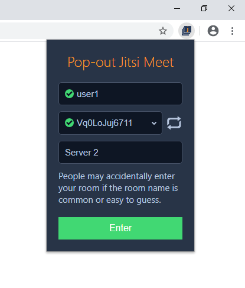

# Pop-out-Jitsi-Meet
Open [Jitsi Meet](https://jitsi.org/) videos in pop-out windows. Useful if you want to arrange your video conference across multiple monitors, or if you want to grab a clean feed of the videos with e.g. [OBS Studio](https://obsproject.com/).

### How to use
1. Install first (see instructions below)
2. Click the extension icon  in the top right of your browser toolbar.
3. Pick a nickname, and generate a hard to guess room name.
4. Choose the desired server: Server 1 [meet.jit.si](https://meet.jit.si/), Server 2 [8x8.vc](https://8x8.vc/) and Server 3 [jitsi.riot.im](https://jitsi.riot.im/)
5. Hit enter to open the main Jitsi Meet window. It will ask your for microphone and camera permission. Click "Allow", otherwise it won't work. If you click "Block", then Jitsi won't work until you manually remove the servers from these two block lists: `chrome://settings/content/camera` and `chrome://settings/content/microphone`.
6. Click a video thumbnail on the left to open it in a pop-out window.
7. Put the pop-out video where you want, maybe on a different monitor, and press enter to toggle full screen.

The extension icon shows a green square while you're in a conference. Click the icon during a conference to copy the invite link, to invite others to the conference. From there you can also click the "Open" button to jump back to the main Jitsi Meet window, or "Close" to stop the conference and close all related windows.

### Server compatibility
This extension works with the Jitsi Meet servers hosted at [meet.jit.si](https://meet.jit.si/), [8x8.vc](https://8x8.vc/) and [jitsi.riot.im](https://jitsi.riot.im/).

### Browser compatibility
Jitsi Meet currently only works properly in Chromium based browsers (not Firefox). This extension has been developed for Google Chrome. I briefly tested it in Brave browser, but it doesn't ([yet](https://github.com/brave/brave-browser/issues/9009)) work there. May work in other Chromium based browsers like the new [Microsoft Edge](https://www.microsoft.com/edge) or [Opera](https://www.opera.com/).

### Installation instructions
This extension is not yet in the Chrome Web Store, so you need to install it manually.
1. Download [this repository](https://github.com/Jip-Hop/Pop-out-Jitsi-Meet/archive/master.zip) and unzip it somewhere.
2. Copy and paste `chrome://extensions` in the URL bar of Google Chrome, hit enter.
3. Switch on "Developer Mode" in the top right.
4. Click "Load unpacked" in the top left.
5. Browse to the folder where you unzipped the download of this repository, go into the "Pop-out-Jitsi-Meet-master" folder and into the "extension" folder inside of it. Now click select to load the extension.
The extension should now appear on the top right in the browser toolbar. Since it's manually installed with developer mode turned on, Chrome may warn you from time to time. Just ignore that for now. If you click "Disable", and you want to use the extension again, you need to enable it again from `chrome://extensions`.

### Self hosted Jitsi Meet
It doesn't work with other instances of Jitsi Meet. If you host your own version of Jitsi Meet, or want to use other servers, then you need to fork this extension and add the desired domains to "matches" for "content_scripts" in the manifest.json file. Additionally you'd have to add the desired domains to `window.servers` in the background.js file. Also, you'd need to come up with an alternative to the invite link shown in the browser action popup, since it won't link to your alternative servers.

### Capturing the streams
The reason I made this extension is to reliably capture a clean feed from the participants in the video conference, using [OBS Studio](https://obsproject.com/). Currently window grabbing only works well on Windows (not [MacOS](https://obsproject.com/forum/threads/screen-tearing-random-glitching-w-window-capture.95181/)), so these instructions are Windows only.
1. Download, install and open [OBS Studio](https://obsproject.com/).
2. [Turn off Hardware Acceleration in Google Chrome](https://www.howtogeek.com/412738/how-to-turn-hardware-acceleration-on-and-off-in-chrome/), otherwise OBS will just capture a black window (but in the future you may keep Hardware Acceleration enabled).
3. Start a conference using the extension in Google Chrome.
4. In the main Jitsi Meet window, click a video thumbnail on the left to open it in a pop-out window. Go into full screen by pressing the enter button.
5. Leave the full screen window open, and go back to OBS Studio, using e.g. ALT+TAB. In OBS, add a "Window Capture" to the "Sources". Make sure to pick the pop-out window in the "Window" dropdown. The window name follows the following pattern: "\[chrome.exe\]: Jitsi Meet | nickname". In the "Capture Method" dropdown you should choose be "BitBlt", otherwise it's not (yet) possible to hide the mouse cursor. In the third dropdown, "Window Match Priority", make sure to select "Window title must match" and uncheck "Capture Cursor".
6. Arrange the source in your scene however you like.
7. Repeat steps 4 to 6 to add more videos from the conference to OBS.
8. Keep the full screen pop-out windows running in the background. Put the Jitsi Meet main window on top to keep an overview of what's happening in the conference, and put the OBS window next to it, to control the final output.
Note: for the window capture to work reliably, it's important that every participant in the conference uses a unique nickname. Else the window capture won't pick the right window each time.

